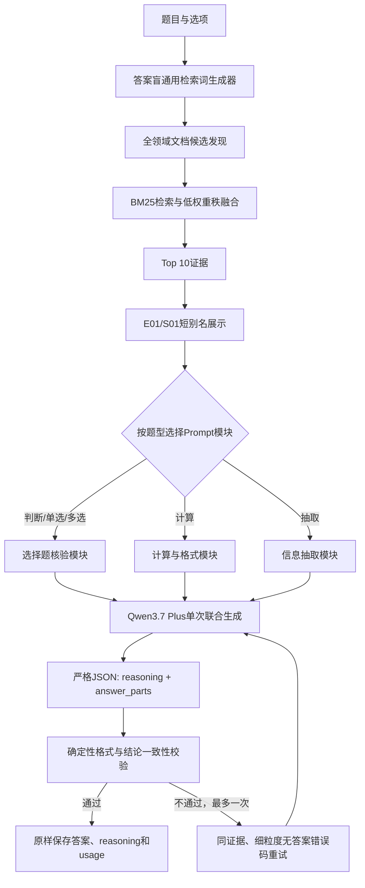

# B榜答案盲检索 + Qwen模块化Prompt验证

## 结论

当前代码恢复并晋级 `modular_prompt_stratified16_v2`：

- 生成链路不读取QID、pseudo99、官网锁定答案、solver或固定locator。
- Qwen一次联合生成最终 `answer_parts + reasoning`。
- 代码只解析和校验，不补写、改写或总结reasoning。
- 16道不重复分层样本全部生成成功，与pseudo99候选等价匹配16/16。
- 该匹配率是离线代理指标，不是官网准确率。
- 唯一判断题另做4次稳定性复测，4次均为A且均一次成功；不计入16题准确率分母。

## 生产链路



## Prompt模块

### 通用约束

- 只能依据题目和检索证据，不使用题号、历史答案、隐藏标签或外部知识。
- reasoning是最终提交文本，会脱离题目、证据和答案单独评审。
- reasoning必须包含主体、年份或适用范围、关键事实、必要判断或计算。
- reasoning末尾必须机械复制answer_parts：
  - 单槽：`结论：<槽1>`
  - 多槽：`结论：<槽1>；<槽2>`
- 不得用“正确/错误”、单位或解释替代槽内文本。

### 选择题模块

- 内部逐项核验主体、时间、指标、范围、否定词和例外。
- 模型不输出逐项Boolean或中间结构，只输出最终答案和reasoning。
- 判断题只允许A/B；单选题只允许一个字母。
- 多选题的JSON Schema枚举全部合法组合，从生成层禁止单字母。

### 计算题模块

- 核对主体、年份、指标口径、单位和取值范围。
- reasoning保留必要公式、关键代入值和舍入结果。
- 检查汇总值是否已包含分项，避免重复计算。
- 检查百分比、最大/最小、差额、累计值、排序和槽位顺序。
- answer_parts严格遵循题面和槽位模板的小数位、百分号和分隔符。

### 抽取题模块

- 核对主体、年份、指标、单位和槽位顺序。
- 直接复述证据支持的字段，不做无关计算。

## 证据短别名与审计闭环

模型Prompt只看到：

```text
来源：
[S01] annual_catl_2025_report

证据：
[E01|S01] title=2025年年度报告 / 现金分红
……
```

每题raw artifact同时保存：

- `E01 -> 原unit_id/doc_id/title_path` 可逆映射；
- Prompt截断文本与原文本SHA-256；
- 原始messages、严格Schema、raw response和content；
- 每次调用的prompt/completion/total tokens；
- 最终答案和reasoning哈希；
- `answer_modified=false`、`reasoning_modified=false`。

每个已返回的模型调用会立即原子落盘，避免重试期间进程异常导致已消耗usage丢失。

## 固定样本

100题实际分布：

| 题型 | 数量 |
|---|---:|
| 多选 | 66 |
| 计算 | 26 |
| 单选 | 7 |
| 判断 | 1 |

因此不存在5道不重复判断题。本轮采用16道不重复真题：

| 题型 | QID |
|---|---|
| 多选 | `fc_b_017`, `fin_b_005`, `ins_b_016`, `reg_b_009`, `res_b_017` |
| 单选 | `fc_b_016`, `reg_b_024`, `reg_b_021`, `reg_b_013`, `fc_b_006` |
| 判断 | `fc_b_013` |
| 计算 | `fc_b_014`, `fin_b_019`, `ins_b_019`, `reg_b_007`, `res_b_012` |

抽样只使用题面、选项长度、数字字面量数量和槽位数，不读取答案。

## 三轮结果

| 轮次 | Schema顺序 | 成功题 | 重试 | 总Token | pseudo99等价匹配 | 结论 |
|---|---|---:|---:|---:|---:|---|
| A1 | reasoning→answer | 9/16 | 8 | 119,678 | 8/16 | 粗粒度重试码导致7题失败 |
| A2 | reasoning→answer | 16/16 | 5 | 109,789 | 16/16 | 当前晋级 |
| A3 | answer→reasoning | 15/16 | 3 | 103,772 | 12/16 | Token下降但准确率显著下降，拒绝 |

A2相对A1：

- 总Token下降9,889，降幅8.26%；
- 失败题由7降为0；
- 代理匹配由8/16升至16/16；
- 5次重试仍消耗31,239 Token，占A2总Token的28.45%。

A3证明不能为了省Token让模型“先答后解释”：

- `fin_b_019`先输出差额0.54，reasoning随后正确算出0.84；
- `res_b_012`先输出占位值999999.99，reasoning随后正确算出67.1；
- 多选题出现3道相对A2的答案漂移；
- 因此即使总Token再下降5.48%，仍不能晋级。

## 当前剩余风险

1. A2的16/16只是与未提交pseudo99候选一致，不等于官网100%准确。
2. A2仍有5次格式重试，主要是首答reasoning漏写机械结论。
3. `ins_b_016=BD`与材料语义可能冲突；本链路答案盲，A2恰好输出BD不能证明材料能推出平台隐藏标签。
4. 下一轮Token优化必须开新方向，不能继续调整本方向的Schema顺序；该方向已达到3轮上限。

## 全量100题验证

复用A2的16题后，剩余84题独立运行；失败题按“证据覆盖”和“格式闭环”两类做通用恢复。所有源调用均保留并累计，最终结果：

| 指标 | 结果 |
|---|---:|
| 成功题数 | 100/100 |
| 原始模型调用 | 172 |
| 额外调用 | 72 |
| Prompt Token | 774,199 |
| Completion Token | 293,023 |
| 总Token | 1,067,222 |
| Token效率分 | 78.65556 |
| pseudo99等价匹配 | 74/100 |
| 官网准确率 | 未提交，未知 |

全量验证暴露并修复了三个通用问题：

1. 有锚点文档时，旧代码完全丢弃文档发现阶段的其他候选，跨年份和跨产品问题召回不全；现改为锚点优先、发现结果补齐。
2. 文档配额可以占满最终Top K，甚至挤出primary第一名；现强制先保留primary Top4。
3. `999999.99`格式占位符曾被直接放入Prompt，模型会复制占位值；现只从模板推导小数位，不展示模板值。

全量pseudo99代理分领域：

| 领域 | 匹配 |
|---|---:|
| financial_contracts | 16/20 |
| financial_reports | 10/20 |
| insurance | 13/20 |
| regulatory | 18/20 |
| research | 17/20 |

因此全量文件虽然格式、模型、usage与生成合规审计全部通过，但代理准确率明显低于历史99%候选。是否消耗官网提交次数应单独决策。

## 产物

- A1：`artifacts/b_board_actual/retrieval_llm_baseline/modular_prompt_stratified16_v1`
- A2：`artifacts/b_board_actual/retrieval_llm_baseline/modular_prompt_stratified16_v2`
- A3：`artifacts/b_board_actual/retrieval_llm_baseline/modular_prompt_stratified16_v3`
- 判断稳定性：`artifacts/b_board_actual/retrieval_llm_baseline/tf_stability_v2_r1` 至 `r4`
- 全量提交：`artifacts/b_board_actual/retrieval_llm_baseline/full100_submit_v1/submit.csv`
- 完整实验记录：`wiki/b_board_actual_loop_log.md`
