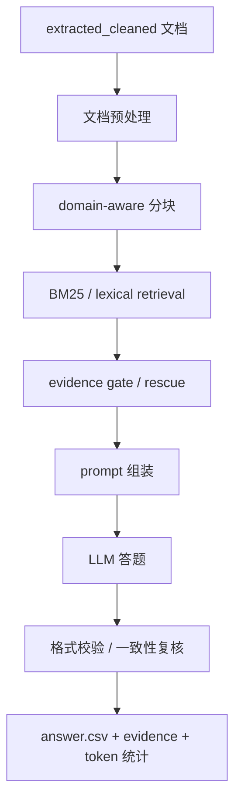
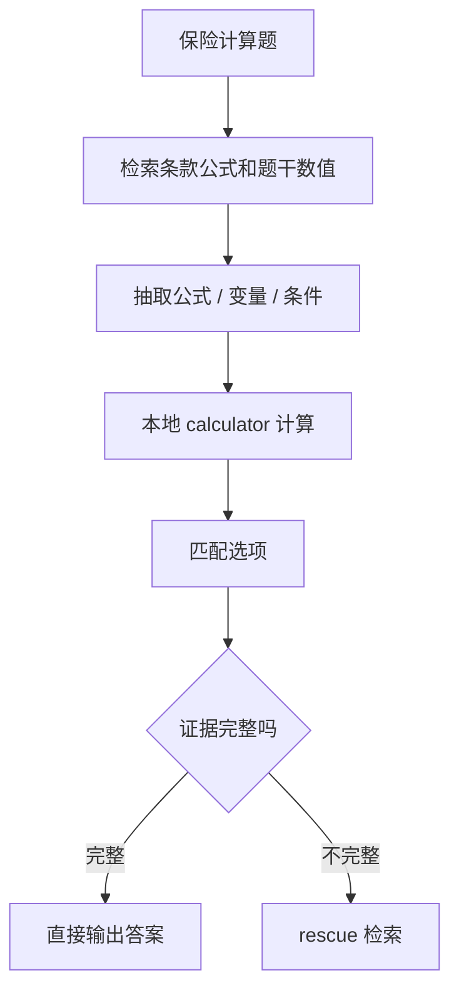
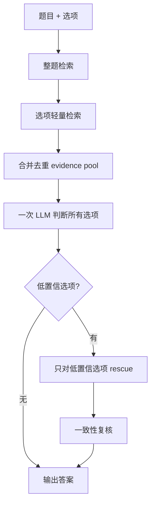
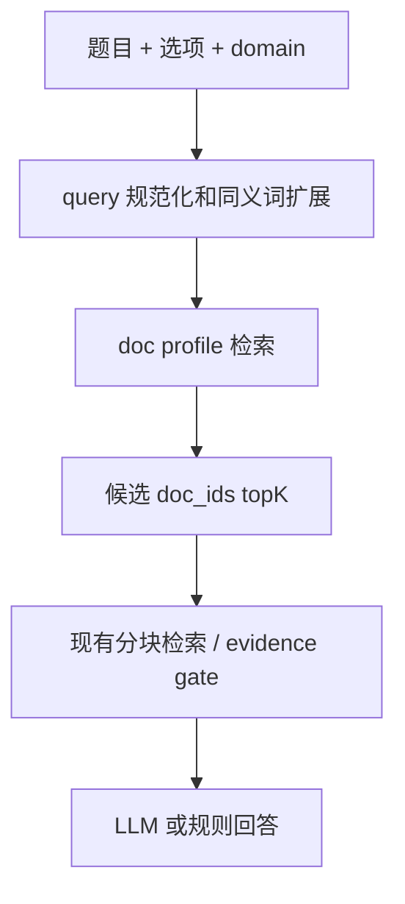

# 链路优化方向与结果反推分析框架

本文档用于沉淀当前项目中已经讨论过的优化方向，并定义下一阶段从结果、case、evidence 和 token 消耗反推优化点的分析框架。

当前项目已经具备一条可复现链路：文档预处理与分块、BM25 检索、evidence gate rescue、prompt 组装、模型回答、答案合并与 token 统计。下一步优化不应只从单个模块出发，而应同时从两条线推进。注意：历史最优版本或 V20 只能作为参考结果，不能默认当成真值；后续判断应直接从题目、证据链和答案一致性出发。

- 链路正向优化：分析每个环节是否存在结构性短板。
- 结果反向优化：从高风险 case 和高 token case 倒推出真正值得改的地方。

本文档给出优化方向、优先级和建议验证方式，目标是让其他队员可以基于同一套思路继续复现、定位问题和迭代。

## 1. 当前链路概览



已有复现流程采用两轮策略：

- Round0 baseline：对 100 题全量回答，产出初始答案、证据、置信度和 token。
- Round1 rescue：只重跑低置信题，使用更强检索和 evidence gate。
- Final merge：rescue 结果覆盖 baseline，保持提交顺序输出最终答案。

当前主要产物位置：

- 复现技术文档：`wiki/group_a_dynamic_confidence_reproduction.md`
- 当前复现产物：`artifacts/reproducible_runs/group_a_dynamic_confidence_20260630_180128/`
- 置信度审计：`confidence_audit.csv`
- token 拆分：`token_usage_breakdown.csv`
- 低置信题列表：`uncertain_qids.txt`

## 2. 已讨论的链路优化方向

### 2.1 文档预处理与分块

当前五类 domain 都已经做了预处理和领域分块，但优化深度不同。`regulatory` 是目前专项处理最充分的一类；其他 domain 虽然已有领域 unit，但还没有逐类做完整 bad case 迭代。

可优化点：

- 对 `financial_reports`、`insurance`、`research`、`financial_contracts` 分别做 loop-engine 式预处理审计。
- 检查原文中的表格、公式、标题层级、页码、图注、目录、免责声明是否被正确保留或剔除。
- 按 domain 重新评估 chunk 粒度，避免证据块过宽、过碎或跨越无关上下文。
- 对多文档题检查每个文档是否都有可召回 evidence unit。

优先关注：

- `financial_reports`: 表格指标、年份、单位、数值是否结构化。
- `insurance`: 条款层级、公式、触发条件、免赔额、给付比例是否完整。
- `financial_contracts`: 发行要素表、评级、金额、期限、转股价格、回售赎回条款是否被抽成字段块。
- `research`: 结论句、预测句、趋势句和图表附近数值是否可检索。

### 2.2 表格结构化

当前 PDF 表格多数被转成带 `|` 的文本行，再由 BM25 召回。它能保留表格文本，但没有显式保存表头、行名、列名、单元格之间的关系。

可优化点：

- 将财报表格升级为 `metric_name + year + value + unit + company/doc_id`。
- 将合同要素表升级为 `field + value + aliases + doc_id`。
- prompt 中优先展示结构化表格摘要，而不是原始长表格行。
- evidence gate 增加表格完整性检查：指标名、年份、数值、单位必须同时出现。

示例目标结构：

```json
{
  "unit_type": "metric_cell",
  "metric": "营业收入",
  "year": "2024",
  "value": "777102455000.00",
  "unit": "元",
  "doc_id": "annual_byd_2024_report"
}
```

### 2.3 检索同义词与领域词典

检索失败经常不是因为没有内容，而是题目和文档用词不同。需要将同义词扩展用于 query builder、jieba dictionary 和 evidence gate。

示例：

| domain | 题目说法 | 文档可能说法 |
|---|---|---|
| financial_reports | 营收 | 营业收入 / 营业总收入 |
| financial_reports | 归母净利润 | 归属于上市公司股东的净利润 |
| insurance | 基本保额 | 基本保险金额 |
| insurance | 赔付 | 给付 / 赔偿 / 报销 |
| financial_contracts | 发行规模 | 发行金额 / 募集资金总额 |
| regulatory | 报告 | 报送 / 备案 / 披露 |
| research | 市场空间 | 市场规模 / 行业规模 |

可优化点：

- 建立 domain synonym registry。
- query 中对 canonical term 做 alias expansion。
- evidence gate 覆盖判断允许 alias 命中。
- B 榜 doc locator 也复用同义词表。

### 2.4 题型化 prompt

不同题型的判断方式不同，不宜全部使用同一个 prompt。

可优化点：

| 题型 | prompt 重点 |
|---|---|
| 事实查询 | 只判断证据是否直接支持，不要脑补 |
| 计算题 | 先抽公式和变量，再计算，再匹配选项 |
| 比较分析 | 列出比较对象、指标、时间、数值 |
| 推理判断 | 检查触发条件是否满足 |
| 多选题 | 每个选项独立判断，最终至少两个选项 |
| 判断题 | 明确 A/B 语义，避免不确定时误判为真 |

保险和财报的计算题建议要求模型输出结构化中间量，而不是直接心算最终答案。

### 2.5 保险计算工具化

保险计算题不适合完全交给 LLM 心算。更稳的方式是让模型或规则抽取公式、变量和适用条件，本地工具负责算术、排序和选项匹配。

建议方向：

- 新增可插拔 `insurance_calculator`。
- 使用 `Decimal` 做金额、百分比、免赔额、给付比例计算。
- 支持 `max/min`、扣除已领取金额、封顶限额、共享免赔额、较大者/较小者。
- 计算证据不完整时触发 rescue，而不是直接让模型猜。

目标流程：



### 2.6 共享 evidence pool 与整题一次判断

当前部分 solver 会逐选项检索和逐选项调用模型，token 成本较高。很多选项其实共享同一组证据。

可优化点：

- 先构建 question-level evidence pool。
- 每个选项只记录 `matched_evidence_ids`。
- 默认整题一次 LLM 判断所有选项。
- 只有低置信选项触发逐选项 rescue。

目标流程：



### 2.7 B 榜无 doc_ids 的文档定位

B 榜没有 `doc_ids`，现有链路不能直接依赖题目给定文档范围。需要增加 doc routing / doc locating 层。

建议方向：

- 新增可插拔 `doc_locator`。
- 输入题目、选项和 domain，输出 candidate doc ids、分数和理由。
- 将候选 doc ids 临时填回 `Question.doc_ids`，复用现有检索和推理流程。
- 在 A 榜上做 doc_ids mask 实验，评估 B 榜可行性。

建议实验：

| 实验 | 做法 | 目的 |
|---|---|---|
| A0 | 使用真实 doc_ids | 当前上限 |
| A1 | mask doc_ids，不加 locator | 当前流程对 doc_ids 的依赖程度 |
| A2 | mask doc_ids，使用 doc locator topK | 模拟 B 榜 |
| A3 | A2 + evidence gate 扩文档 rescue | 模拟最终 B 榜策略 |

### 2.8 答案格式与一致性约束

多选题、判断题、单选题都有格式约束。格式修正不能只在最后兜底，否则可能把低质量答案伪装成合法答案。

可优化点：

- 多选题 prompt 明确“至少两个选项”，但不能为了凑数选择无证据项。
- `option_labels`、`reasoning_summary`、`pred_answer` 必须一致。
- 若格式被强制修正，需要在 audit 中标记 `format_forced`。
- 如果 evidence 与最终答案冲突，应触发 final consistency guard。

## 3. 结果反推优化框架

正向链路分析容易产生过多想法。下一阶段应从当前结果反推，优先处理真实影响准确率或 token 成本的点。

反推分析分两张核心表：

- Case Risk Audit：找最可能错的题，判断为什么不确定。
- Token ROI Audit：找 token 花得最多但收益不明显的题。

### 3.1 Case Risk Audit

目标：从不同 domain 分析题目、选项、evidence 和 reasoning，判断不确定性来自哪里。

建议字段：

| 字段 | 含义 |
|---|---|
| qid | 题目 ID |
| domain | 题目类型 |
| answer_format | 单选、多选、判断 |
| pred_answer | 当前答案 |
| confidence_score | 当前置信度 |
| evidence_count | 最终证据数量 |
| gate_status | evidence gate 状态 |
| low_reasons | 低置信原因 |
| format_error | 格式错误 |
| missing_doc_ids | 缺失文档 |
| evidence_problem_type | 证据问题类型 |
| likely_failure_type | 可能失败原因 |
| recommended_action | 建议动作 |

建议失败类型：

| 类型 | 含义 | 常见动作 |
|---|---|---|
| `missing_evidence` | 没有检到关键证据 | 扩 query、加同义词、提高 topK |
| `wrong_chunk` | 文档对但 chunk 不对 | 调分块、邻居扩展、标题检索 |
| `evidence_contradiction` | 证据与答案相反 | prompt 复核、answer consistency guard |
| `answer_layer_error` | 证据正确但模型判断错 | 题型 prompt、few-shot、规则层 |
| `format_forced` | 格式被强制修正 | 优化 prompt 和 finalization |
| `rule_shortcut_risk` | 规则命中但证据链较薄 | 规则输出补 evidence gate |
| `doc_routing_risk` | B 榜可能找不到文档 | doc locator / mask 实验 |

### 3.2 Token ROI Audit

目标：从每题 token 消耗倒排，判断哪些操作可以减少 token 而不明显伤害准确率。

建议字段：

| 字段 | 含义 |
|---|---|
| qid | 题目 ID |
| domain | 题目类型 |
| round0_tokens | baseline token |
| rescue_tokens | rescue token |
| final_tokens | 总 token |
| answer_changed_by_rescue | rescue 是否改变答案 |
| confidence_before | rescue 前置信度 |
| confidence_after | rescue 后置信度 |
| evidence_count_before | rescue 前证据数量 |
| evidence_count_after | rescue 后证据数量 |
| token_roi_label | token 投入收益标签 |
| recommended_token_action | token 优化动作 |

建议 ROI 标签：

| 标签 | 含义 | 可优化方向 |
|---|---|---|
| `high_cost_high_value` | token 高，但答案或置信度明显改善 | 保留策略 |
| `high_cost_low_value` | token 高，但答案没变、证据没变 | 压缩 prompt 或跳过 rescue |
| `rule_candidate` | 可由规则或计算工具提前截断 | 加规则/工具 |
| `prompt_compress_candidate` | prompt 或 evidence 过长 | 证据摘要、结构化表格 |
| `single_call_candidate` | 逐选项调用成本高 | 整题一次判断 |
| `evidence_pool_candidate` | 多选项共享证据重复 | evidence pool 去重 |

### 3.3 当前复现数据中的初步信号

基于当前 `group_a_dynamic_confidence_20260630_180128` 复现产物，token 和低置信压力主要集中在：

| domain | 总 token | 平均每题 token | 低置信题数 |
|---|---:|---:|---:|
| financial_contracts | 175,827 | 8,791 | 8 |
| regulatory | 110,364 | 5,518 | 7 |
| insurance | 61,716 | 3,086 | 7 |
| financial_reports | 71,748 | 3,587 | 0 |
| research | 4,191 | 210 | 1 |

初步判断：

- `financial_contracts` 和 `regulatory` 是 token 优化主战场。
- `insurance` 是计算和题型判断稳定性的主战场。
- `financial_reports` 当前置信度高但 token 不低，适合做 prompt 压缩和表格结构化。
- `research` 当前大量 case 低 token，优先级相对靠后，但需要注意规则/硬编码风险。

优先审计 case：

- 高 token 且低置信：`reg_a_008`、`reg_a_007`、`fc_a_007`、`fc_a_014`、`fc_a_020`、`fc_a_019`
- 高 token 但高置信：`fc_a_004`、`fc_a_015`、`fin_a_011`、`fin_a_012`
- 保险格式/计算风险：`ins_a_007`、`ins_a_009`、`ins_a_010`、`ins_a_015`、`ins_a_019`
- 零 token 规则题：确认是否是可靠规则，还是隐藏过拟合风险

## 4. Evidence-First 分析原则

后续 case 分析不要先问“和 V20 是否一致”，而是先问“当前答案是否被自己的 evidence 支撑”。如果 evidence 不足，即使答案碰巧正确，也应标记为高风险。

建议每题按以下顺序审计：

1. 题目要求是什么：单选、多选、判断、计算、比较、法规适用。
2. 每个选项是否有直接 evidence：证据是否覆盖对象、指标、时间、条件和结论。
3. evidence 是否和最终答案一致：避免 reasoning 说“不确定”但 final 仍选中。
4. evidence 是否来自正确文档或正确片段：尤其是多文档题、表格题、法规条款题。
5. 如果答案变化，变化是否由新增证据支持，而不是 prompt 风格变化导致。

Evidence-first 审计标签：

| 标签 | 含义 | 后续动作 |
|---|---|---|
| `supported` | 答案被证据直接支持 | 可保留 |
| `weak_supported` | 证据方向对，但缺少关键条件、时间或数值 | 触发定向 rescue |
| `unsupported` | 答案没有证据支持 | 检索或文档定位优先 |
| `contradicted` | 证据与答案相反 | 触发 final consistency guard |
| `format_conflict` | 证据判断和题型格式要求冲突 | prompt 和 finalizer 同时检查 |
| `rule_unverified` | 规则直接输出但没有证据链 | 规则补 evidence audit |

## 5. A 榜到 B 榜迁移方案

B 榜没有 `doc_ids`，这是后续最重要的不确定性。当前 A 榜链路中很多题依赖已知文档范围；如果直接迁移到 B 榜，需要先解决“去哪批文档里找证据”的问题。

建议新增可插拔 `doc_locator` 层：



`doc_locator` 的输入输出：

| 字段 | 含义 |
|---|---|
| question | 原始题目 |
| options | 选项文本 |
| domain | 题目类型 |
| candidate_doc_ids | 候选文档 |
| locator_score | 文档定位分数 |
| locator_reason | 命中原因，例如公司、产品名、法规标题、证券代码 |

建议先在 A 榜做 doc_ids mask 实验：

| 实验 | 做法 | 目的 | 优先级 |
|---|---|---|---|
| A0 | 使用真实 `doc_ids` | 当前链路上限 | P0 |
| A1 | 去掉 `doc_ids`，不加 locator | 衡量当前流程对 doc_ids 的依赖 | P0 |
| A2 | 去掉 `doc_ids`，使用 doc locator topK | 模拟 B 榜基础方案 | P0 |
| A3 | A2 + evidence gate 扩文档 rescue | 模拟 B 榜增强方案 | P0 |
| A4 | A3 + token 压缩策略 | 评估准确率和 token 平衡 | P1 |

Doc locator 的 domain 线索：

| domain | 优先定位线索 |
|---|---|
| insurance | 产品名、保险责任、条款标题、给付项目、公式关键词 |
| financial_reports | 公司名、股票简称、年份、指标名、报告标题 |
| financial_contracts | 发行人、证券简称、债券代码、转债名称、评级、发行规模 |
| regulatory | 法规标题、文号、监管机构、当事人、处罚类型、条款号 |
| research | 行业主题、地区、时间、指标、报告标题、结论关键词 |

评估指标：

- `doc_recall@K`: 正确文档是否进入候选 topK。
- `evidence_recall@K`: 正确证据片段是否被召回。
- `answer_accuracy`: 最终答案准确率。
- `token_per_question`: 每题 token 成本。
- `no_docid_failure_type`: 无 doc_ids 后失败原因。

## 6. Token 压缩策略

Token 压缩不能只做截断，否则容易伤害证据完整性。更合适的目标是减少重复、减少无效 rescue、把可结构化的信息从长文本变成短证据卡。

优先策略：

| 策略 | 做法 | 适用场景 | 优先级 |
|---|---|---|---|
| evidence pool 去重 | 整题先合并证据，再让选项引用 evidence id | 多选题、逐选项重复检索 | P0 |
| 低置信才 option rescue | 只对不确定选项做二次检索和二次 LLM | insurance、contracts | P0 |
| 结构化 evidence card | 表格、公式、条款转成短字段 | financial_reports、financial_contracts、insurance | P0 |
| dynamic topK | 高置信少取，低置信再扩 | 全 domain | P0 |
| 本地计算和规则 early stop | 算术、格式、确定性规则不调用 LLM | insurance、financial_reports、research | P1 |
| prompt 模板分型 | 单选、多选、计算、判断使用短模板 | 全 domain | P1 |
| rescue ROI 约束 | 上一轮无收益则收紧 rescue | 高 token case | P1 |

Prompt 层压缩建议：

- 不把完整 chunk 全塞给模型，先转成 `evidence_id + source + fact`。
- 表格题只传相关行、列、单位和数值，不传整页表格。
- 多选题使用一次调用判断所有选项，输出每个选项的 `supported / unsupported / uncertain`。
- 仅当 final consistency guard 发现矛盾时，才发起二次判断。

## 7. 分 Domain 优化点

### 7.1 Regulatory

主要风险：

- 检索到法规或处罚决定，但 chunk 没覆盖关键条款。
- 证据支持部分选项，未覆盖未选项。
- 法条中的期限、主体、报告对象、例外条件容易漏。
- 规则或 gate 判断和 final answer 不一致。

优化方向：

- 抽取法规条款卡：`条号 + 主体 + 动作 + 期限 + 对象 + 例外`。
- 对处罚决定抽取：`当事人 + 违法事实 + 处罚类型 + 禁入期限 + 文号`。
- selected option gate 必须通过；未通过时触发条款号、当事人、处罚类型定向检索。
- final consistency guard 检查 evidence、reasoning、answer 是否一致。

优先级：P0。

### 7.2 Financial Reports

主要风险：

- 表格行被当成普通文本，年份、单位、指标和值的关系不稳定。
- 计算题靠模型心算，容易出现单位换算和同比方向错误。
- 当前置信度高但 token 不低，存在压缩空间。

优化方向：

- 抽取 `metric_cell`: `公司 + 年份 + 指标 + 值 + 单位 + 表名`。
- 本地计算同比、差值、比例、排序，再让模型只做解释或选项匹配。
- evidence gate 要求同一指标的两年值同时出现。

优先级：P1，若后续发现 B 榜表格召回明显下降，则升为 P0。

### 7.3 Insurance

主要风险：

- 计算题让模型直接算，可靠性不稳定。
- 多选题存在“格式要求至少两个”和“证据只支持一个”的冲突。
- 部分 case reasoning 表示证据不足，但 final 仍给出确定答案。
- 逐选项检索和逐选项调用 token 成本较高。

优化方向：

- 增加 `insurance_calculator`: 抽公式、变量和条件，本地用 `Decimal` 计算。
- 产品级 evidence coverage：涉及多个产品时，每个产品都必须有证据。
- 多选题 prompt 明确输出每个选项的支持状态，最终答案只能来自 `supported` 选项；如果不足两个，需要标记 `format_conflict`，不能盲目凑数。
- 先整题 evidence pool，一次 LLM 判断；低置信选项再 option-level rescue。

优先级：P1，其中 consistency guard 和 evidence pool 属于 P0。

### 7.4 Research

主要风险：

- 当前 token 很低，可能有规则或硬编码风险。
- 研究报告常见趋势、预测、规模、年份等事实，证据如果过短容易漏条件。
- A 榜表现好不代表 B 榜能稳定找到报告。

优化方向：

- 抽取 `data_point`: `对象 + 时间 + 地区 + 指标 + 数值 + 趋势`。
- 规则题也输出 evidence id，避免只有答案没有证据链。
- B 榜 doc locator 中加入行业主题、地区、时间和指标定位。

优先级：P2；若 mask doc_ids 后 doc recall 下降，则升为 P1。

### 7.5 Financial Contracts

主要风险：

- token 消耗最高，低置信题也多。
- 债券、转债、发行要素、评级、回售赎回条款分散在长文档。
- 多文档题容易用一个文档证据替代另一个文档。
- 规则题和零 token 题需要补证据审计，避免 A 榜过拟合。

优化方向：

- 抽取 `contract_field`: `发行人 + 证券简称 + 代码 + 字段名 + 字段值 + 单位`。
- 建立 doc-order map，处理“第几个文档”“上述两个文档”等题型。
- 多文档题强制 per-doc coverage，每个目标文档至少有证据。
- 对发行规模、评级、期限、转股价格、资产负债率等字段优先结构化检索。

优先级：P0。

## 8. 优化优先级矩阵

| 优先级 | 优化项 | 主要收益 | 目标 domain | 代表风险 case / 现象 | 验证方式 |
|---|---|---|---|---|---|
| P0 | Evidence-first audit + final consistency guard | 提升答案可靠性 | 全 domain | evidence 与 final answer 矛盾 | contradiction 数量下降 |
| P0 | A 榜 doc_ids mask + doc locator baseline | 支撑 B 榜迁移 | 全 domain | B 榜无 doc_ids | doc_recall@K、answer accuracy |
| P0 | Case/evidence/token 三联审计页 | 快速定位真实错因 | 全 domain | 高风险 case 分散 | 人工复核效率提升 |
| P0 | Financial contracts 结构化字段和 per-doc coverage | 提升准确率并降 token | financial_contracts | token 最高、低置信多 | 低置信数和 token 同时下降 |
| P0 | Regulatory 条款卡和 selected gate 复核 | 提升法规题稳定性 | regulatory | 条款、期限、处罚类型漏召回 | selected gate fail 减少 |
| P0 | Dynamic topK + 低置信 rescue | 降低无效 token | 全 domain | rescue 无收益、高 topK | token_per_question 下降 |
| P1 | Insurance calculator | 减少计算错误 | insurance | 金额、比例、免赔额计算 | 计算题 evidence 和答案稳定 |
| P1 | Financial reports metric_cell | 表格检索和计算更稳 | financial_reports | 年份、单位、指标关系不稳 | 表格题准确率和 token |
| P1 | Evidence pool + 整题一次判断 | 降低重复 prompt | insurance、contracts、regulatory | 多选题逐选项重复 | token 下降，准确率不降 |
| P1 | 同义词和领域词典扩展 | 提升召回 | 全 domain | 题目词与文档词不一致 | evidence recall@K |
| P1 | 题型化 prompt/few-shot | 减少答案层错误 | 全 domain | 多选、判断、计算语义混乱 | answer-layer error 下降 |
| P2 | Research data_point 抽取 | 降低规则过拟合风险 | research | 低 token 但证据链薄 | 规则题 evidence 完整 |
| P2 | 非 regulatory 预处理 loop audit | 长期提升数据质量 | insurance、contracts、reports、research | 表格、条款、图注处理不均 | chunk 覆盖审计 |
| P2 | 可视化审计页标准化 | 方便团队协作复核 | 全 domain | evidence 复核成本高 | review HTML 统一 |

## 9. 下一步建议执行顺序

### Step 1: 生成 case/evidence/token 三联审计页

为重点 case 生成 HTML 或 Markdown 审计页，展示：

- 题目与选项
- 当前答案与置信度
- round0/rescue/final token
- 检索 query
- top evidence
- evidence gate 状态
- 模型 reasoning
- 最终证据链是否支撑答案
- 可能错因
- 建议优化动作

### Step 2: 对低置信 case 做人工错因标注

优先标注 `uncertain_qids.txt` 中的题，尤其是高 token 且低置信的 case。每题只需要判定主因：

- 文档定位问题
- 检索问题
- chunk 问题
- 表格/公式结构问题
- prompt 判断问题
- 格式修正问题
- 规则风险

### Step 3: 对高 token case 做 ROI 判断

对 token top cases 标注 rescue 是否有效：

- 若 rescue 改变答案且证据更完整，保留。
- 若 rescue 不改变答案，考虑降低 topK、减少轮数或只做 evidence pool。
- 若是逐选项重复证据，改为整题一次判断。
- 若是计算题，改为本地工具计算。

### Step 4: 再回到链路做 targeted implementation

根据 Step 2/3 的标注结果决定真实开发顺序。避免先做看起来漂亮但不影响错误 case 的模块。

推荐决策规则：

| 观察结果 | 优先动作 |
|---|---|
| 多数错因是找不到文档 | 做 doc locator / B 榜 mask 实验 |
| 多数错因是表格数值读错 | 做表格结构化 |
| 多数错因是保险计算错 | 做 insurance calculator |
| 多数错因是证据对但答案错 | 做题型 prompt / few-shot |
| 多数 token 浪费在重复 evidence | 做 evidence pool / single-call |
| 多数 token 浪费在 rescue 无收益 | 做 rescue trigger 收紧 |

## 10. 验收标准

后续每个优化方向都需要同时看准确率和 token：

- 准确率不能只看整体，要看 domain 和高风险 case。
- token 不能只看总量，要看每题 ROI。
- 对答案变化 case 必须保存 before/after evidence。
- 对 B 榜相关优化必须在 A 榜 doc_ids mask 实验中验证 doc recall。
- 新增规则或工具必须输出可审计 evidence，不允许只输出答案。

最低产物要求：

- `case_risk_audit.csv`
- `token_roi_audit.csv`
- `case_evidence_review.html`
- `optimization_recommendations.md`

## 11. 结论

下一阶段的核心不是单纯“继续加强检索”或“继续调 prompt”，而是建立一套结果驱动的优化闭环：

```text
结果倒排 -> case/evidence/token 审计 -> 错因归类 -> targeted implementation -> 再复现对比
```

这样才能知道每一次改动到底是在提升准确率、降低 token，还是只是增加系统复杂度。
