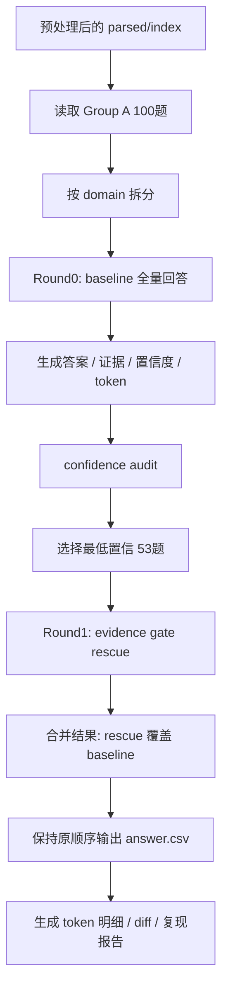
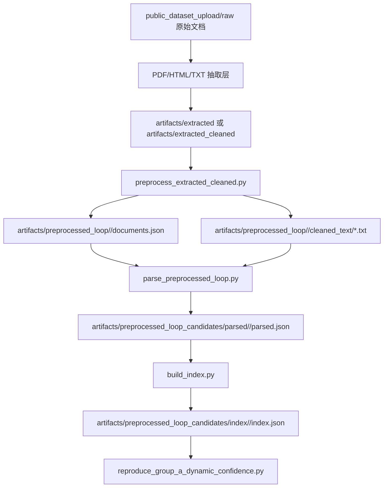
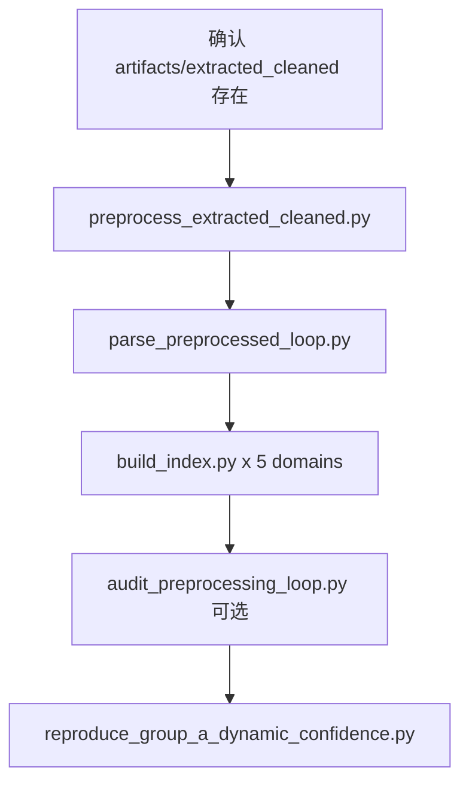
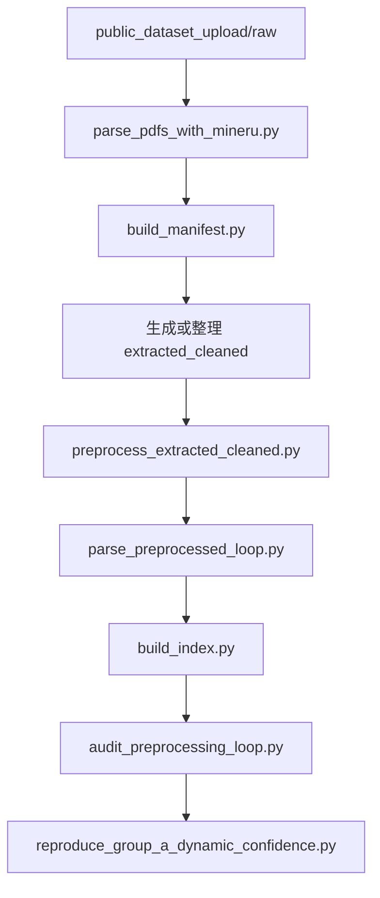
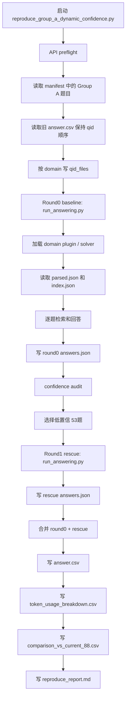
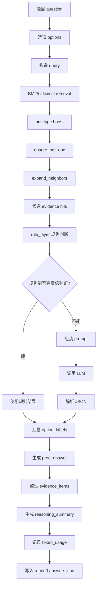
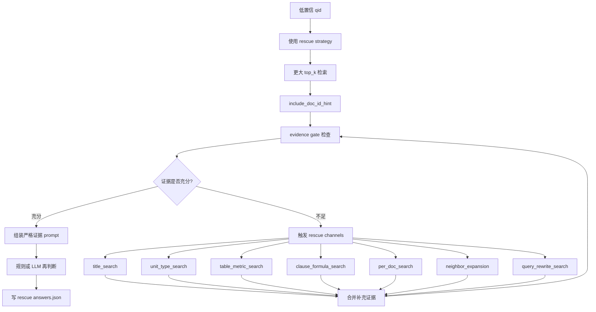

# Group A 动态置信度复现流程技术文档

本文档说明当前项目中 **Group A 100 道题动态置信度复现实验** 的完整可运行流程。目标读者包括研发、算法、数据处理和人工复核同学。读完后应能理解：

- 为什么流程分为 baseline 和 rescue 两轮。
- baseline 每个环节在做什么。
- rescue 为什么只重跑低置信题。
- 最终 `answer.csv`、token 统计和 diff 报告是怎么生成的。
- 如何复现、恢复中断运行、排查常见问题。

## 一句话概览

当前流程先用 baseline 策略对 Group A 100 道题全部回答一遍，得到初始答案、证据和置信度；再从 100 道题中动态挑出 53 道低置信题，用 evidence gate rescue 策略重跑；最后用 rescue 结果覆盖对应的 baseline 结果，并按原提交顺序输出最终 `answer.csv` 和 token 明细。



## 关键术语

| 术语 | 含义 |
|---|---|
| Group A | 当前评测集的 100 道题，分为 5 个 domain。 |
| domain | 题目类型，目前包括 `regulatory`、`financial_reports`、`insurance`、`research`、`financial_contracts`。 |
| parsed.json | 文档预处理和分块后的结构化文本单元。 |
| index.json | 基于 parsed 文本建立的检索索引。 |
| chunk / unit | 从文档中切出的可检索文本片段。不同 domain 会有不同 unit 类型，例如 `metric_row`、`clause_block`、`element_block`。 |
| BM25 / lexical retrieval | 基于词项匹配的检索方式，用来从 index 中召回证据片段。 |
| solver | 每个 domain 自己的答题逻辑，负责检索、规则判断、prompt 组装和答案输出。 |
| baseline | 第一轮全量答题策略，目标是稳定覆盖 100 题，并产出置信度。 |
| confidence audit | 对 baseline 结果做审计，判断哪些题低置信，需要进入 rescue。 |
| evidence gate | 证据门控机制，检查证据是否覆盖选项、文档、条款、指标等关键要素。 |
| rescue | 第二轮补救策略，只重跑低置信题，使用更强的检索和证据约束。 |

## 代码入口

一键复现入口：

```bash
PYTHONPATH=src /opt/miniconda3/envs/afa-autoresearch/bin/python \
  scripts/reproduce_group_a_dynamic_confidence.py \
  --workers 5
```

脚本位置：

- `scripts/reproduce_group_a_dynamic_confidence.py`

内部调用的单 domain 答题入口：

- `scripts/run_answering.py`

核心配置：

- Round0 baseline 配置：`configs/autoresearch/default_strategy.json`
- Round1 rescue 配置：`configs/autoresearch/evidence_gate_rescue_accuracy_first.json`

## 运行前准备

### 1. 模型配置

项目当前读取 `.env` 中的 `LLM_*` 配置：

```text
LLM_API_KEY=<your_api_key>
LLM_API_BASE=https://dashscope.aliyuncs.com/compatible-mode/v1
LLM_MODEL=qwen3.7-plus
```

当前项目不需要使用 `OPENAI_API_KEY`、`OPENAI_BASE_URL`、`MODEL_NAME` 这些别名；统一使用 `LLM_API_KEY`、`LLM_API_BASE`、`LLM_MODEL`。

### 2. 文档预处理产物

本流程默认 **不重新解析 PDF/HTML**，而是读取已经生成好的预处理和索引结果：

```text
artifacts/preprocessed_loop_candidates/parsed/<domain>/parsed.json
artifacts/preprocessed_loop_candidates/index/<domain>/index.json
```

如果要重新优化 PDF 解析、分块或 index，需要在本流程之前先更新这些 parsed/index 产物。

### 3. 题目顺序

最终 `answer.csv` 需要保持原提交顺序。脚本默认使用：

```text
artifacts/submissions/group_a_20260628_preprocessed_loop_full/answer.csv
```

这个文件只用于确定 qid 顺序，不代表最终答案一定沿用它。

## 文档解析、清洗、分块和建索引流程

当前答题脚本依赖 `parsed/index`，而 `parsed/index` 来自上游文档处理流程。为了让其他队员能复现结果，这里把上游流程单独拆开说明。

### 上游处理总览



最短复现路径是从已有的 `artifacts/extracted_cleaned` 开始：

```bash
# 1. 从 extracted_cleaned 生成 cleaned_text 和 documents.json
PYTHONPATH=src /opt/miniconda3/envs/afa-autoresearch/bin/python \
  scripts/preprocess_extracted_cleaned.py \
  --domains all \
  --extracted-root artifacts/extracted_cleaned \
  --output-root artifacts/preprocessed_loop

# 2. 从 cleaned_text 生成 parsed.json，也就是 domain-aware chunks/units
PYTHONPATH=src /opt/miniconda3/envs/afa-autoresearch/bin/python \
  scripts/parse_preprocessed_loop.py \
  --domains all \
  --preprocessed-root artifacts/preprocessed_loop \
  --output-root artifacts/preprocessed_loop_candidates/parsed

# 3. 为每个 domain 生成 index.json
for d in regulatory financial_reports insurance research financial_contracts; do
  PYTHONPATH=src /opt/miniconda3/envs/afa-autoresearch/bin/python \
    scripts/build_index.py \
    --domain "$d" \
    --parsed-path "artifacts/preprocessed_loop_candidates/parsed/$d/parsed.json" \
    --output-path "artifacts/preprocessed_loop_candidates/index/$d/index.json"
done
```

跑完后，答题流程会读取：

```text
artifacts/preprocessed_loop_candidates/parsed/<domain>/parsed.json
artifacts/preprocessed_loop_candidates/index/<domain>/index.json
```

### Step 0: PDF/HTML/TXT 抽取层

本项目里存在两种上游来源：

1. 已经抽取并清洗好的文本层：`artifacts/extracted_cleaned`
2. 原始数据层：`public_dataset_upload/raw`

当前成功复现使用的是第 1 种，即把 `artifacts/extracted_cleaned` 当作“PDF/HTML 已经解析完的源文本层”。如果队员本地已经有这层数据，可以直接从 Step 1 开始。

如果本地已有 `artifacts/extracted`，可以用 `scripts/clean_extracted.py` 生成 `artifacts/extracted_cleaned`。这个脚本主要处理页眉页脚、目录、图片链接、低价值 OCR 行、重复短行，以及 regulatory 原始 `txt/html` 文件的初步清洗。

如果需要从原始 PDF 重建，可以先运行 MinerU 解析脚本：

```bash
PYTHONPATH=src /opt/miniconda3/envs/afa-autoresearch/bin/python \
  scripts/parse_pdfs_with_mineru.py \
  --domain financial_reports \
  --backend pipeline \
  --method auto \
  --lang ch \
  --enable-table \
  --no-enable-formula \
  --no-enable-image-analysis
```

该脚本会扫描 `public_dataset_upload/raw/**/*.pdf`，输出到：

```text
artifacts/mineru/docs/<domain>/<doc_id>/
artifacts/mineru/manifest.json
```

每个 PDF 会有：

| 文件/目录 | 含义 |
|---|---|
| `raw_output/` | MinerU 原始输出。 |
| `normalized/content.md` | 规范化后的 markdown 主文本。 |
| `normalized/content.txt` | 同内容 txt 版本。 |
| `logs/stdout.log`、`logs/stderr.log` | 解析日志。 |
| `meta.json` | 单文档解析状态、命令、耗时、输出文件等元信息。 |

然后运行：

```bash
PYTHONPATH=src /opt/miniconda3/envs/afa-autoresearch/bin/python \
  scripts/build_manifest.py
```

`build_manifest.py` 会生成：

```text
artifacts/manifest/dataset_manifest.json
```

manifest 的作用是告诉后续 parser：每个 doc_id 对应哪个源文件、源文件类型是什么、题目文件在哪里。

注意：当前复现流程主要从 `artifacts/extracted_cleaned` 继续。如果完全从原始 PDF 重建，解析结果可能和本次成功复现使用的 source layer 不完全一致，因此最终答案也可能有差异。

### Step 1: extracted_cleaned 到 preprocessed_loop

脚本：

```text
scripts/preprocess_extracted_cleaned.py
```

职责：

1. 扫描 `artifacts/extracted_cleaned/<domain>/` 下的 `.md`、`.txt`、`.html`、`.htm`。
2. 把每个文件清洗成纯文本。
3. 为每个文档写一个 cleaned text 文件。
4. 生成该 domain 的 `documents.json` 和 `summary.json`。

输出：

```text
artifacts/preprocessed_loop/<domain>/documents.json
artifacts/preprocessed_loop/<domain>/summary.json
artifacts/preprocessed_loop/<domain>/cleaned_text/*.txt
```

`documents.json` 中每条记录大致包含：

| 字段 | 含义 |
|---|---|
| `doc_id` | 文档 id。 |
| `domain` | 所属题型。 |
| `source_path` | 清洗前源文件路径。 |
| `cleaned_path` | 清洗后纯文本路径。 |
| `source_suffix` | 源文件后缀，如 `.md`、`.txt`、`.html`。 |
| `source_relpath` | 相对于 domain 目录的路径。 |
| `before_chars` / `after_chars` | 清洗前后字符数。 |
| `before_html_tag_count` / `after_html_tag_count` | 清洗前后残留 HTML 标签数量。 |
| `before_broken_number_count` / `after_broken_number_count` | 清洗前后数字断裂数量。 |

清洗规则重点：

- HTML 输入优先抽正文容器：`.detail-news`、`.TRS_Editor`、`#zoom`、`.content`、`article`。
- 删除 `script/style/noscript/form/header/footer/nav/img` 等非正文节点。
- Markdown/TXT 输入会删除 mermaid、残留 HTML 标签、图片说明、空 details、导航噪声。
- 修复数字断裂，例如 `〔\n2024\n〕\n112\n号` 会恢复成 `〔2024〕112号`。
- 合并数字和单位之间的换行，例如 `100\n万元`、`2025\n年`。
- 删除 `首页`、`当前位置`、`English`、`微博`、`微信` 等导航行。

这一步的目标是：**保留正文和表格文本，尽量去掉导航、图片、页眉页脚、HTML 标签和数字断裂噪声。**

### Step 2: preprocessed_loop 到 parsed chunks

脚本：

```text
scripts/parse_preprocessed_loop.py
```

职责：

1. 读取 `artifacts/preprocessed_loop/<domain>/documents.json`。
2. 打开每个 `cleaned_path`。
3. 为每个文档创建 `Document` 对象。
4. 按 domain 规则切成 units/chunks。
5. 输出统一结构的 `parsed.json`。

输出：

```text
artifacts/preprocessed_loop_candidates/parsed/<domain>/parsed.json
```

`parsed.json` 的核心结构：

```json
{
  "documents": [
    {
      "doc_id": "...",
      "domain": "...",
      "title": "...",
      "source_type": "preprocessed_text",
      "source_path": "...",
      "metadata": {}
    }
  ],
  "units": [
    {
      "unit_id": "...",
      "doc_id": "...",
      "domain": "...",
      "unit_type": "...",
      "title_path": ["..."],
      "text": "...",
      "page_refs": [],
      "parent_unit_id": "...",
      "metadata": {}
    }
  ]
}
```

### Step 2.1: 通用分块逻辑

`parse_preprocessed_loop.py` 会先按标题、章节、条款或段落边界切分。之后会运行 `finalize_units()` 做兜底切分：

- 如果 unit 过长，优先按句号、分号、问号、感叹号或换行切开。
- 如果单个片段仍然超过上限，则硬切。
- 保留 `parent_unit_id`，方便知道它来自哪个原始 unit。
- 对重复 `unit_id` 自动加 `__dupN` 后缀。

不同 unit 的长度上限：

| unit_type | 上限 |
|---|---:|
| `metric_row`、`element_block` | 700 chars |
| `penalty_decision`、`formula_block`、`clause_block` | 900 chars |
| `article`、`article_chunk`、`preamble` | 1200 chars |
| 默认 paragraph | 1000 chars |

### Step 2.2: 各 domain 分块策略

| Domain | 分块策略 | 额外高亮 unit |
|---|---|---|
| `regulatory` | 优先按法规条文切成 `article` / `article_chunk`；如果不是法条型文本，则按处罚决定正文切成 `penalty_decision`。 | 对处罚决定保留事实、依据、决定附近文本。 |
| `financial_reports` | 按标题/段落切成 `paragraph`，同时抽取包含财务指标和数字的窗口。 | `metric_row`，如营业收入、归母净利润、经营现金流、研发投入、分红比例等。 |
| `insurance` | 按标题/条款切成 `clause_block`。 | 包含账户价值、已交保费、基本保额、现金价值等关键词时复制为 `formula_block`。 |
| `research` | 按段落切成 `paragraph`。 | 包含预计、同比、市场规模、渗透率、增速、结论、投资建议等关键词时复制为 `conclusion_block`。 |
| `financial_contracts` | 按段落切成 `paragraph`，并抽取发行要素、评级、期限、利率、回售、赎回、违约等窗口。 | `element_block`；表格中的 key-value 行也会抽成 `element_block`。 |

这里的“复制为高亮 unit”不是删除原段落，而是额外生成一份更容易被检索 boost 命中的结构化 unit。这样既保留原文上下文，也能让 BM25 更容易命中关键证据。

### Step 3: parsed 到 index

脚本：

```text
scripts/build_index.py
```

职责：

1. 读取某个 domain 的 `parsed.json`。
2. 调用对应 domain plugin 的 `build_index()`。
3. 生成 `index.json`。

输出：

```text
artifacts/preprocessed_loop_candidates/index/<domain>/index.json
```

当前 `index.json` 主要保存：

| 字段 | 含义 |
|---|---|
| `domain` | domain 名。 |
| `documents` | 文档元信息。 |
| `units` | 检索单元。 |
| `unit_count` | 部分 domain 会记录 unit 数量。 |

BM25 索引不是以二进制形式持久化的；运行答题时，retriever 会从 `index.json["units"]` 现场构造 BM25：

- 通用 domain 使用 `GenericBM25Retriever`。
- regulatory 使用 `RegulatoryRetriever`，可以额外加载监管领域词典。
- 中文分词通过 `jieba` 完成。
- 检索文本通常由 `title_path + text + metadata` 组合而来。

### Step 4: 预处理质量检查

建议每次改动清洗、分块或 index 后，先跑预处理审计：

```bash
PYTHONPATH=src /opt/miniconda3/envs/afa-autoresearch/bin/python \
  scripts/audit_preprocessing_loop.py \
  --domains all \
  --extracted-root artifacts/extracted_cleaned \
  --manifest-path artifacts/manifest/dataset_manifest.json \
  --parsed-root artifacts/preprocessed_loop_candidates/parsed \
  --index-root artifacts/preprocessed_loop_candidates/index \
  --retrieval-mode sample \
  --retrieval-sample-size 5 \
  --output-dir artifacts/preprocessing_loop_audit/latest
```

输出：

```text
artifacts/preprocessing_loop_audit/latest/audit.json
artifacts/preprocessing_loop_audit/latest/report.md
```

重点看：

| 指标 | 作用 |
|---|---|
| source file count / suffixes | 检查源文件是否缺失。 |
| source char length p50/p90/max | 判断是否有异常短文档或超长噪声文档。 |
| parsed docs/units | 检查分块是否产出。 |
| unit type counts | 检查高亮 unit 是否生成，如 `metric_row`、`formula_block`。 |
| unit length p50/p90/max | 判断 chunk 是否过长或过短。 |
| retrieval doc hit rate | 检索是否能命中题目指定文档。 |
| multi-doc coverage avg | 多文档题是否覆盖足够文档。 |
| weak questions | 预处理/检索明显弱的题。 |

### 推荐复现顺序

如果队员只想复现当前结果，推荐顺序是：



如果队员要从原始 PDF 重建，推荐顺序是：



注意：从原始 PDF 重新解析会引入解析器版本、OCR、表格识别和换行差异，不保证和当前成功复现目录完全一致。要复现本文档记录的结果，应优先使用同一份 `artifacts/extracted_cleaned` 和 `artifacts/preprocessed_loop_candidates`。

## 端到端流程



## Baseline 详解

baseline 是第一轮全量回答流程，对应配置：

```text
configs/autoresearch/default_strategy.json
```

它的目标不是把每道题都做到最重、最贵，而是：

1. 对 100 道题全部给出初始答案。
2. 为每道题留下 evidence、reasoning、token usage。
3. 通过规则和模型置信度判断哪些题可能有风险。
4. 为后续 rescue 提供低置信候选集合。

### Baseline 单题流程图



### Baseline 检索配置

默认检索策略：

| 配置 | 当前值 | 含义 |
|---|---:|---|
| `query_mode` | `question_option` | 使用题干和选项共同构造 query。 |
| `include_question_type` | `true` | query 中考虑题型信息。 |
| `include_doc_id_hint` | `false` | baseline 默认不强行把 doc id 放入 query。 |
| `top_k` | `6` | 每题默认召回 6 个候选片段。 |
| `max_hits_for_prompt` | `6` | 最多把 6 个片段放进 prompt。 |
| `ensure_per_doc` | `true` | 多文档题尽量保证每个文档都有证据。 |
| `expand_neighbors` | `true` | 命中 chunk 后补充相邻 chunk，缓解切块断裂。 |

不同 domain 有自己的 unit boost：

| Domain | 偏好的 unit 类型 | 原因 |
|---|---|---|
| `financial_reports` | `metric_row` | 财报题通常依赖表格指标和数值。 |
| `insurance` | `formula_block`、`clause_block` | 保险题常依赖条款和赔付公式。 |
| `research` | `conclusion_block` | 研报题常问结论、趋势、规模。 |
| `financial_contracts` | `element_block` | 合同题常问发行规模、评级、期限、违约条款等结构化字段。 |
| `regulatory` | 默认 paragraph/article 片段 | 监管题常依赖法规条文和处罚决定正文。 |

### Baseline 规则层

baseline 开启 `rule_layer.enabled=true`。规则层会在调用 LLM 前尝试本地判断，例如：

- 财报题：同比增长、下降、财务指标数值比较。
- 保险题：特定产品公式、等待期、免责条款、宽限期等规则。
- 研报题：明确事实、数值、对象限定。
- 合同题：发行人、主承销商、评级、转股价格、违约利息、通知期限等字段。
- 监管题：法条义务、期限、报告对象、处罚类型等规则。

如果规则能够高置信判断，就直接输出答案，不调用模型。因此部分题的 token usage 为 0，这是正常现象。

### Baseline 何时调用 LLM

当规则层不能直接判断时，solver 会把题目、选项、检索证据和格式要求组装成 prompt，调用模型判断每个选项是否成立。

模型需要输出结构化 JSON，例如：

```json
{
  "answer": "AC",
  "confidence": 0.82,
  "confidence_reason": "证据覆盖 A/C 的关键指标，但 B/D 存在反向表述。",
  "reasoning_summary": "A 正确；B 错误；C 正确；D 错误。"
}
```

不同 domain 的 solver 可能按 option-level 判断，也可能按 whole-question 判断。

### Baseline 产物

每个 domain 会写入：

```text
artifacts/reproducible_runs/<run_id>/round0/runs/<domain>_round0/
```

关键文件：

| 文件 | 含义 |
|---|---|
| `outputs/debug/answers.json` | 该 domain 的逐题回答结果。 |
| `outputs/debug/evidence.jsonl` | 证据调试信息，具体存在情况取决于 runner/exporter。 |
| `meta/run_manifest.json` | 本次 domain run 的配置、模型和范围信息。 |
| `planned_command.json` | 该 domain 子进程的可复现命令。 |

## Confidence Audit 详解

Round0 完成后，脚本会对 100 道题逐题审计，生成：

```text
confidence_audit.csv
```

审计字段包括：

| 字段 | 含义 |
|---|---|
| `qid` | 题目 id。 |
| `domain` | 题目所属 domain。 |
| `answer_format` | 答案格式，如 `single`、`multi`。 |
| `pred_answer` | baseline 预测答案。 |
| `confidence_score` | 统一后的置信度分数。 |
| `model_confidence` | 模型或规则给出的置信度。 |
| `gate_certainty` | evidence gate 或规则审计中的确定性。 |
| `low_reasons` | 被判定为低置信的原因。 |
| `format_error` | 是否存在格式错误。 |
| `missing_doc_ids` | 多文档题中缺失证据的文档。 |
| `evidence_count` | 使用证据数量。 |
| `token_usage` | Round0 token 使用情况。 |

当前脚本默认选择置信度最低的 53 道题：

```text
uncertain_qids.txt
```

这个 53 不是固定 qid 列表，而是每次根据当前 Round0 结果动态选出来的低置信集合。

## Rescue 详解

rescue 是第二轮补救流程，对应配置：

```text
configs/autoresearch/evidence_gate_rescue_accuracy_first.json
```

rescue 只重跑 `uncertain_qids.txt` 里的低置信题，不重跑全部 100 题。

### Rescue 流程图



### Rescue 和 baseline 的差异

| 环节 | Baseline | Rescue |
|---|---|---|
| 运行范围 | 100 题全量 | 只跑低置信 53 题 |
| 目标 | 快速覆盖，产出初始答案和置信度 | 提升低置信题准确性 |
| `top_k` | 默认 6/7 | 默认 8，rescue 可到 12 |
| `include_doc_id_hint` | false | true |
| evidence gate | 默认不开 | 开启 |
| prompt | 默认模板 | `evidence_strict` |
| 检索通道 | 基础 BM25 + boost + neighbor | 额外增加 title/table/clause/per-doc/query rewrite 等 |
| token | 相对低 | 较高 |

### Rescue channels

当前 rescue 配置启用的补充检索通道：

| Channel | 用途 |
|---|---|
| `option_assertion_search` | 针对选项中的核心断言重新检索。 |
| `contradiction_search` | 检索可能反驳选项的证据。 |
| `query_rewrite_search` | 根据失败原因改写 query 后再检索。 |
| `title_search` | 按标题、章节标题、产品名、文档名检索。 |
| `unit_type_search` | 按 unit 类型定向召回，如表格行、条款块、结论块。 |
| `table_metric_search` | 财报/合同中按年份、指标、数值单位检索表格行。 |
| `clause_formula_search` | 保险题中按条款标题和公式关键词检索。 |
| `per_doc_search` | 多文档题按每个 doc 单独检索，避免一个文档证据替代另一个文档。 |
| `neighbor_expansion` | 命中片段后补充前后邻居。 |

## 合并规则

Round0 和 rescue 都完成后，脚本合并答案：

```text
if qid in rescue_answers:
    final_answer = rescue_answer
else:
    final_answer = round0_answer
```

也就是说：

- 没进 rescue 的题，最终使用 baseline 答案。
- 进 rescue 且成功产出结果的题，最终使用 rescue 答案。
- 最终顺序仍然按照原提交 CSV。

## Token 统计口径

最终 token 不是简单读取某一个 answer object，而是按题目重新汇总：

```text
非 rescue 题:
  final_token = round0_token

rescue 题:
  final_token = round0_token + rescue_token
```

本地规则路径不调用 LLM，因此 token 为 0 是正常的。常见情况：

- `research` 中大量题由本地事实规则解决，token 可能为 0。
- `financial_reports` 中部分数值比较题由规则解决，token 可能为 0。
- `regulatory` 中部分明确法条反驳题由规则解决，token 可能为 0。
- `rescue_total_tokens=0` 不一定异常，可能是该 rescue 题也被规则解决。

最终 token 明细见：

```text
token_usage_breakdown.csv
```

最终 `answer.csv` 的 summary 行由每题 final token 求和得到。

## 输出文件说明

每次运行会生成：

```text
artifacts/reproducible_runs/group_a_dynamic_confidence_<timestamp>/
```

关键文件：

| 文件 | 用途 |
|---|---|
| `answer.csv` | 最终提交格式，包含 100 题答案和一行 summary。 |
| `answer_with_domain.csv` | 每题答案、domain、来源 round、置信度和 token。 |
| `confidence_audit.csv` | Round0 后的低置信审计结果。 |
| `uncertain_qids.txt` | 本次动态选出的 53 道 rescue 题。 |
| `token_usage_breakdown.csv` | 每题 Round0、rescue、final token 明细。 |
| `comparison_vs_current_88.csv` | 和当前 88% 参考答案向量的差异。 |
| `final_answers.json` | 最终 answer object 列表。 |
| `audit_logs.jsonl` | confidence audit 的 jsonl 版本。 |
| `run_manifest.json` | 本次运行的全局配置、输入和输出路径。 |
| `reproduce_report.md` | 人类可读的运行摘要。 |
| `round0/` | Round0 各 domain 原始运行目录。 |
| `rescue/` | Rescue 各 domain 原始运行目录。 |

## 最近一次成功复现结果

最近一次成功运行目录：

```text
artifacts/reproducible_runs/group_a_dynamic_confidence_20260630_180128/
```

运行摘要：

| 指标 | 值 |
|---|---:|
| model | `qwen3.7-plus` |
| question_count | 100 |
| uncertain_selected_count | 53 |
| prompt_tokens | 433,276 |
| completion_tokens | 160,570 |
| total_tokens | 593,846 |
| diff_vs_current_88 | 6 |

和当前 88% 参考答案不一致的题：

```text
reg_a_009
reg_a_016
fin_a_016
fc_a_015
fc_a_016
fc_a_017
```

注意：项目本地没有官方标签，因此无法在本地直接计算真实准确率。`comparison_vs_current_88.csv` 只表示和当前已知 88% 答案向量的差异，不等价于真实准确率。

## 如何复现

### 全量复现

```bash
PYTHONPATH=src /opt/miniconda3/envs/afa-autoresearch/bin/python \
  scripts/reproduce_group_a_dynamic_confidence.py \
  --workers 5
```

### 小样本冒烟测试

```bash
PYTHONPATH=src /opt/miniconda3/envs/afa-autoresearch/bin/python \
  scripts/reproduce_group_a_dynamic_confidence.py \
  --limit 5 \
  --low-confidence-count 3 \
  --workers 1
```

### 指定输出目录

```bash
PYTHONPATH=src /opt/miniconda3/envs/afa-autoresearch/bin/python \
  scripts/reproduce_group_a_dynamic_confidence.py \
  --workers 5 \
  --output-dir artifacts/reproducible_runs/<run_dir>
```

### 中断后恢复

如果运行中断，可以复用同一个输出目录：

```bash
PYTHONPATH=src /opt/miniconda3/envs/afa-autoresearch/bin/python \
  scripts/reproduce_group_a_dynamic_confidence.py \
  --workers 5 \
  --output-dir artifacts/reproducible_runs/<existing_run_dir> \
  --skip-api-preflight
```

底层 `run_answering.py` 会读取已有的 `outputs/debug/answers.json`，跳过已完成 qid，继续未完成题目。

## 常见问题

### 1. 为什么有些题 token 为 0？

因为这些题走了本地规则路径，没有调用 LLM API。token 统计只记录 API prompt/completion token，不记录本地检索和规则计算成本。

### 2. 为什么 `rescue_total_tokens` 很多是 0？

可能有两种情况：

- 该题没有进入 rescue，因此 rescue token 本来就是 0。
- 该题进入 rescue，但 rescue 阶段命中规则路径，没有调用 LLM。

最终提交看 `final_total_tokens`。

### 3. 为什么有些 `multi` 题最终只有一个选项？

当前发现 3 道题源数据标记为 `answer_format=multi`，但证据和当前 88% 参考答案都支持单选输出：

```text
ins_a_009 = C
ins_a_012 = A
fc_a_014 = B
```

当前流程没有强制补第二个选项，因为强行补选会偏离证据和参考答案。

### 4. 为什么要先 baseline 再 rescue，而不是全部用 rescue？

全部用 rescue 会显著增加 token 和时间，而且很多题 baseline 已经能高置信解决。当前设计是：

- baseline 负责全量覆盖和风险识别。
- rescue 只处理低置信题，把成本集中花在最可能出错的地方。

### 5. 为什么要和 88% 答案向量对比？

项目本地没有官方标签，无法直接算真实准确率。当前 88% 版本是外部评测得到的已知较优答案向量，因此用它作为回归参考，观察复现流程是否能稳定接近该版本。

### 6. API preflight 失败怎么办？

检查 `.env`：

```text
LLM_API_KEY=...
LLM_API_BASE=https://dashscope.aliyuncs.com/compatible-mode/v1
LLM_MODEL=qwen3.7-plus
```

如果 preflight 失败，脚本会写：

```text
api_preflight_failed.json
```

优先查看里面的 HTTP status、model、api_base 和错误信息。

## 后续可优化方向

1. 改进低置信选择机制：当前默认选 53 道，可改成按阈值或按 domain 配额动态选择。
2. 改进多选格式策略：区分“真实多选”和“源码标 multi 但事实单选”的冲突样本。
3. 改进 token 统计展示：把规则路径、检索成本和 API token 分开展示，避免误解。
4. 将 PDF/HTML 预处理也纳入一键复现链路，使从 `extracted_cleaned` 到最终答案完全自动化。
5. 对 6 道 diff case 做人工证据复核，判断是复现不稳定、参考答案错误，还是当前 prompt/rescue 仍需优化。

## 文件索引

| 类型 | 路径 |
|---|---|
| PDF 解析脚本 | `scripts/parse_pdfs_with_mineru.py` |
| manifest 构建脚本 | `scripts/build_manifest.py` |
| extracted 清洗脚本 | `scripts/clean_extracted.py` |
| extracted_cleaned 预处理脚本 | `scripts/preprocess_extracted_cleaned.py` |
| domain-aware 分块脚本 | `scripts/parse_preprocessed_loop.py` |
| index 构建脚本 | `scripts/build_index.py` |
| 预处理审计脚本 | `scripts/audit_preprocessing_loop.py` |
| 一键复现脚本 | `scripts/reproduce_group_a_dynamic_confidence.py` |
| 单 domain 答题脚本 | `scripts/run_answering.py` |
| baseline 配置 | `configs/autoresearch/default_strategy.json` |
| rescue 配置 | `configs/autoresearch/evidence_gate_rescue_accuracy_first.json` |
| parsed 输入 | `artifacts/preprocessed_loop_candidates/parsed/` |
| index 输入 | `artifacts/preprocessed_loop_candidates/index/` |
| 最近一次成功输出 | `artifacts/reproducible_runs/group_a_dynamic_confidence_20260630_180128/` |
